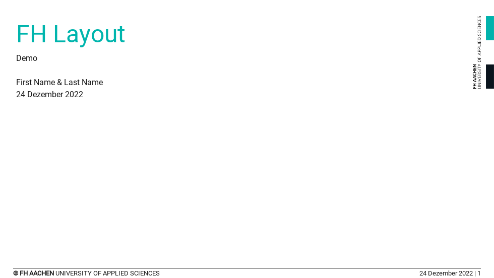
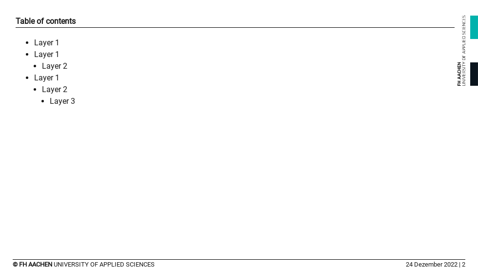
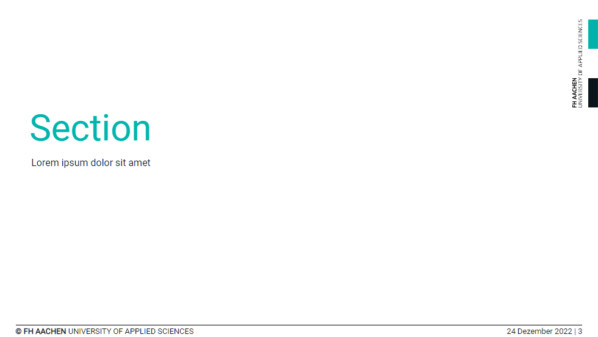
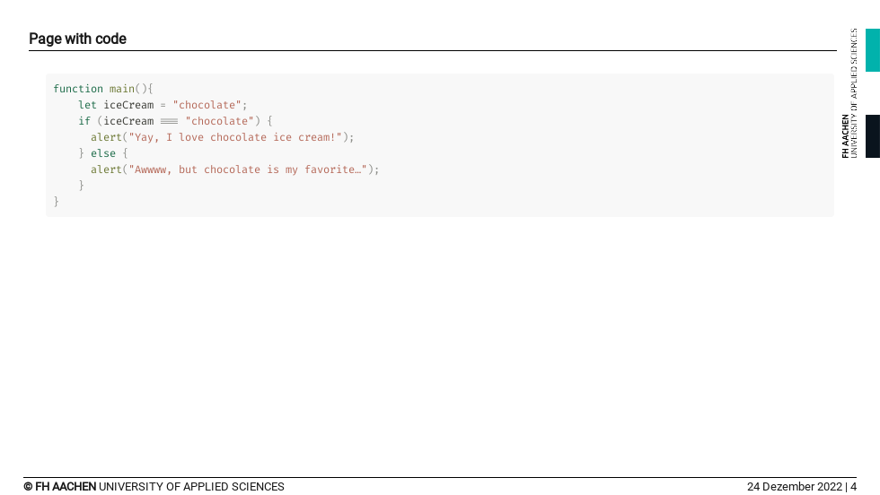
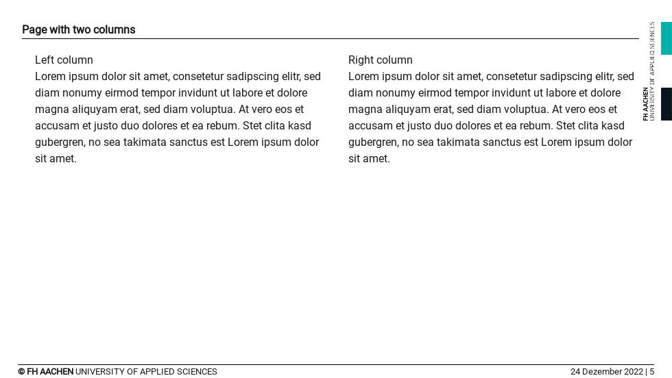
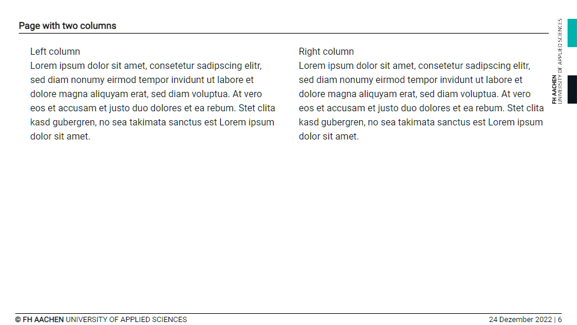
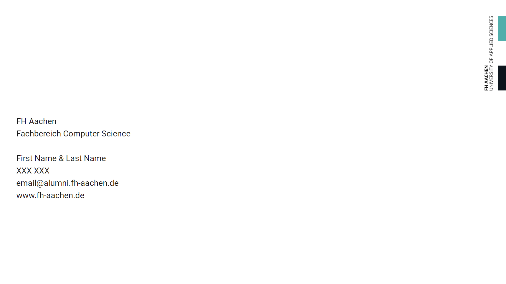

# slidev-theme-fhac

[](https://www.npmjs.com/package/slidev-theme-fhac)


A fhac theme for [Slidev](https://github.com/slidevjs/slidev).

## Install

Add the following frontmatter to your `slides.md`. Start Slidev then it will prompt you to install the theme automatically.

<pre><code>---
theme: <b>fhac</b>
---</code></pre>

Learn more about [how to use a theme](https://sli.dev/themes/use).

## Theme Configuration

```
---
title: FH Layout
subtitle: Demo
date: 24 Dezember 2022
referent: First Name & Last Name
studentnr: XXX XXX
email: email@alumni.fh-aachen.de
faculty: Computer Science
---
```
## Layouts

### `cover`


### `toc`

Can be configured with: 

```
---
header: <text>
subheader: <text>
---
```



### `section`



### `default`

Can be configured with: 

```
---
header: <text>
subheader: <text>
---
```





### `two-cols`

Can be configured with: 

```
---
header: <text>
subheader: <text>
---
```



### `end`



## Contributing

- `npm install`
- `npm run dev` to start theme preview of `example.md`
- Edit the `example.md` and style to see the changes
- `npm run export` to generate the preview PDF
- `npm run screenshot` to generate the preview PNG
